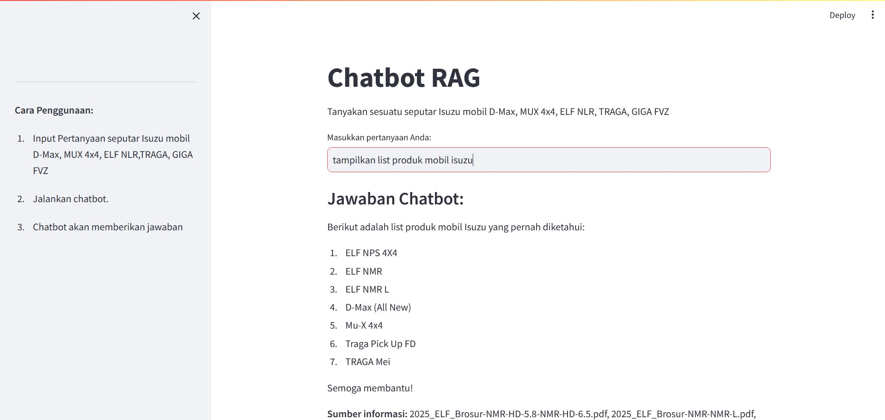
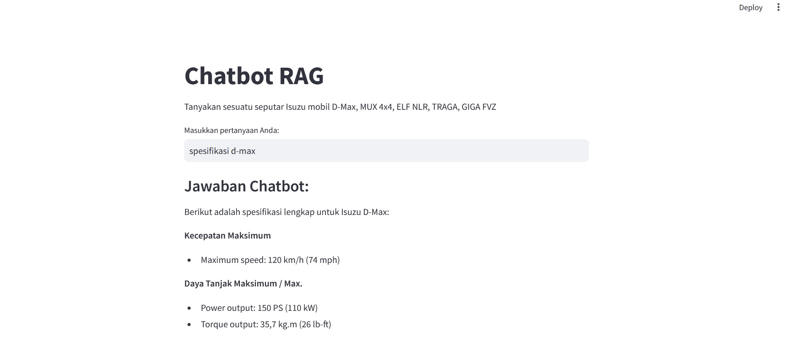
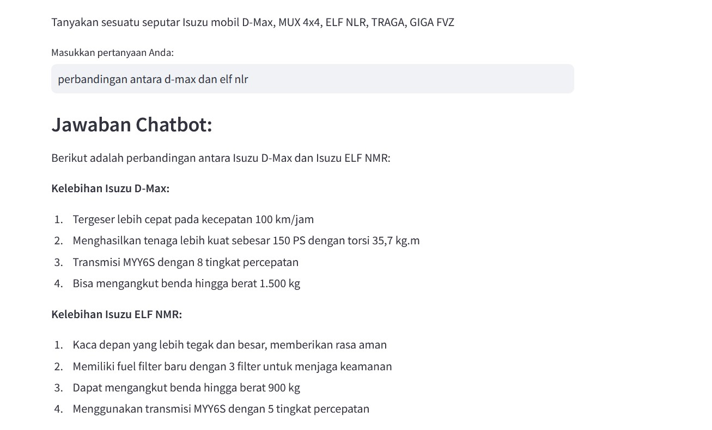
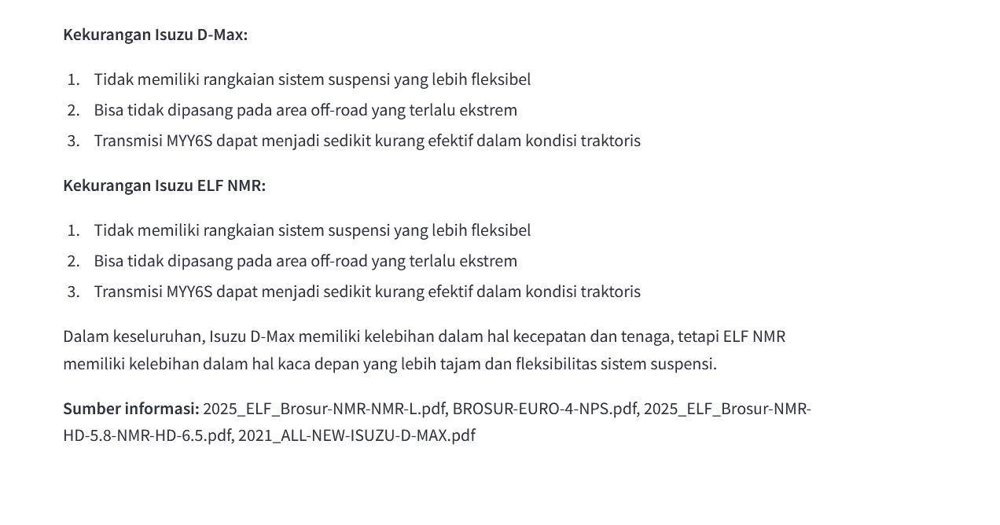

# rag_chatbot

**objective** : create a chatbot using RAG

**Model** : Ollama

**Link** : https://ollama.com/

**How to Use**
 - Run streamlit : streamlit run app.py
 - Enter your question in the prompt and hit enter
 - The chatbot will provide responses according to the context and source of the information
 - 

 - Ask for details
 - 

 - Ask for comparison
 - The chatbot will provide the requested comparison and conclusion
 - 
 - 